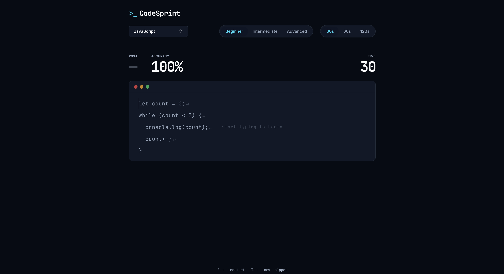

# >_ CodeSprint

<p align="center">
  
  
  
  
  
</p>

CodeSprint is a minimal, developer-focused typing platform designed to help programmers improve coding speed and syntax muscle memory. Instead of typing plain text prose, users practice with real-world code snippets across various languages and difficulty levels. 

The application is built with a singular product vision: **MonkeyType for developers**. It prioritizes a fast, frictionless, and visually premium user experience with zero onboarding, no dashboards, and immediate interaction.



## Key Features

* **Continuous Session Engine:** The typing timer governs the entire session, not individual snippets. Completing a snippet instantly auto-loads the next one without breaking the user's flow.
* **Content-Aware UI:** The typing viewport dynamically resizes to precisely fit the current code snippet with smooth CSS transitions, preventing jarring layout shifts during active sessions.
* **Smart Indentation:** The `Tab` key intelligently consumes up to 4 leading spaces to mimic IDE auto-indentation behavior.
* **Language Variety:** Practice syntax in JavaScript, TypeScript, Python, Java, C++, Rust, and Go.
* **Difficulty Tiers:** Beginner, Intermediate, and Advanced snippets tailored to challenge different skill levels.
* **Real-Time Metrics:** Live updates for WPM and Accuracy calculation without degrading DOM performance.
* **Local Persistence:** Personal best tracking stored via `localStorage`, persisting achievements across visits.
* **Accessible & Premium Design:** A dark-first aesthetic (`#060B14` base) using highly intentional colors (Tailwind / shadcn), JetBrains Mono typography for code, and smooth Framer Motion micro-animations.

---

## Architecture Overview

CodeSprint is a purely client-side Single Page Application (SPA). It intentionally avoids backends, databases, or complex routing in its V1 implementation to optimize for absolute maximum performance and lowest time-to-interactive.

### Tech Stack

* **Core:** React 19, TypeScript, Vite
* **Styling:** Tailwind CSS v4, CSS Variables (Dark-theme first)
* **Components:** Custom implementations + select shadcn/ui primitives (`cmdk`, `radix-ui`)
* **Animation:** Framer Motion
* **Icons:** Lucide React
* **Data:** Local static TypeScript arrays

### Project Structure

```text
src/
├── components/
│   ├── ui/                 # Reusable shadcn/ui base primitives
│   ├── CodeSprintApp.tsx   # Main orchestrator & layout
│   ├── ConfigBar.tsx       # Language/Difficulty/Duration selectors
│   ├── MetricsRow.tsx      # Live WPM/Accuracy/Time display
│   ├── ResultsScreen.tsx   # Post-session summary
│   └── TypingArea.tsx      # Core typing DOM & syntax rendering
├── hooks/
│   └── useTypingEngine.ts  # The "brain" of the application
├── data/
│   └── snippets/           # Static code snippets categorized by language
├── types/
│   └── index.ts            # Global TypeScript interfaces
├── lib/
│   └── utils.ts            # Helper functions (e.g., Tailwind merge)
└── constants/              # Global constants (Language arrays, etc.)
```

---

## Deep Dive: The Typing Engine

The core logic resides entirely within the custom `useTypingEngine` React hook. This ensures that typing state logic is completely decoupled from DOM rendering.

### 1. State Machine
The engine operates on a strict finite state:
* `IDLE`: User is configuring settings. The prompt "start typing to begin" is visible.
* `RUNNING`: Triggered instantly on the first keystroke. The `setInterval` countdown begins.
* `FINISHED`: Timer reaches 0. Reverts the UI to the Results Screen.

### 2. Session-Based Cumulative Tracking
To support a continuous flow, the engine uses persistent `useRef` counters (`sessionTotalTypedRef`, `sessionErrorsRef`) that survive across individual snippets. 

When `currentIndex` reaches the end of a snippet:
1. The current snippet's totals are flushed into the session refs.
2. `advanceSnippet()` instantly picks and loads the next snippet from `data/snippets`.
3. The timer and `testState` are unaffected, allowing the user to continue typing without delay.

### 3. WPM & Accuracy Calculation
* **Gross WPM:** `(total_chars_typed / 5) / elapsed_minutes`
* **Net WPM:** `((total_chars_typed - errors) / 5) / elapsed_minutes`
* WPM is recalculated in real-time every 300ms via a `setInterval` during the `RUNNING` state, ensuring the UI feels alive but doesn't thrash the React render cycle on every single keystroke.

### 4. Anti-Repeat Snippet Pool
Snippets are stored in `sessionStorage` arrays to track which snippets the user has already typed during their current browser session. A random un-typed snippet is always selected. When the pool is exhausted, the history resets.

---

## Deep Dive: UI & Rendering

### The Typing Area (`TypingArea.tsx`)
Rendering a typing test requires extreme care to prevent layout thrashing and maintain high FPS. 

* **The Input Mechanism:** Real typing is captured via a hidden, absolutely-positioned `<textarea>` acting as a focus sink. This handles mobile keyboards and standard OS text events perfectly.
* **The Rendered Code:** The snippet is split into an array of lines, and each line into an array of characters. Each character is rendered as a `<span>` with conditional styling (`text-primary-text` for correct, `bg-error/10` for incorrect).
* **Content-Aware Scrolling:** As the user types, a computed `translateY` value slides the inner container upwards. The active line is always kept horizontally fixed, exactly 2 lines below the top boundary (`LINES_ABOVE = 2`).
* **Content-Aware Sizing:** The outer container dynamically calculates its height based on `lines.length * LINE_HEIGHT_PX`, constrained by a `min-height` and `max-height`. A CSS transition smooths the jump when advancing between snippets of different lengths.

---

## Installation & Setup

### Requirements
* Node.js 18+
* npm

### Local Development

1. **Clone the repository:**
   ```bash
   git clone https://github.com/Heisenberg300604/CodeSprint.git
   cd CodeSprint
   ```

2. **Install dependencies:**
   ```bash
   npm install
   ```

3. **Start the development server:**
   ```bash
   npm run dev
   ```
   The application will be available at `http://localhost:5173`.

### Build for Production

To create an optimized production build:
```bash
npm run build
```
The output will be placed in the `/dist` directory. You can preview the production build locally using `npm run preview`.

---

## Contributing Guide

We welcome contributions! Please adhere to the guidelines set in `Agents.md` regarding product vision and architecture.

### Development Workflow

1. **Simplicity over complexity:** Do not introduce complex state management (like Redux or Zustand) or complex routing. React Hooks are sufficient for V1.
2. **Adding Snippets:** 
   To add new code snippets, modify the respective file in `src/data/snippets/`.
   * Snippets should be formatted exactly as they would appear in an IDE.
   * Do not mix tabs and spaces (use spaces exclusively).
3. **UI Modifications:**
   * Respect the dark-first theme. 
   * The accent color (`#22D3EE`) is reserved for the active cursor, selected options, and CTAs. Do not overuse it as a heavy background.
4. **Performance:** Do not introduce logic into `TypingArea.tsx` that causes unnecessary re-renders. The `useMemo` hooks are carefully placed to ensure high-FPS typing.

### Pull Request Process
1. Create a feature branch from `main`.
2. Ensure TypeScript compiles without errors (`npx tsc --noEmit`).
3. Ensure no ESLint warnings are introduced (`npm run lint`).
4. Verify that the production build compiles successfully by running `npm run build`.
5. Submit a PR outlining the *what* and *why* of your changes.

---

## License
*This project is provided without an explicit license in the repository. Please contact the maintainer for usage rights.*